<!--more-->


I'm going to assume some familiarity with SHAP analysis as there are lots of great resources online to get a good introduction


## Model Explainability

Since the SHAP Python package was introduced in 2017 it has become an essential aspect of any machine learning project lifecycle. SHAP analysis makes it easy to understand what relationships your machine learning model has learned, and also works for a wide variety of model types.

Despite SHAP’s usefulness, we (Data Scientists) may not be using it to it's full potential. Let me demonstrate what I mean using a classic ML benchmark, the **Adult Census Income dataset**. Each row is an person and the goal is to predict whether someone earns **more than $50K per year** using demographic and economic features like:

- Age  
- Education level  
- Marital status  
- Occupation  
- Hours worked per week  
- Capital gains and losses  

## Typical SHAP Analysis

Let's imagine predicting income is a real problem in my company and I'm conducting some discovery analysis to see if a ML model can help. Ive trained a **LightGBM classifier** on this dataset and I'm happy with the initial performance, so now the task is to understand what the model has learned. In my experience this typically boils down to:
- Global summary plots
- Local waterfall plots
- Dependence plots (maybe)

#### **Global summary plots**

These are great for showing which features tend to matter most (or not at all) and tells you the directionality of their impact. However, since you will almost certainly have correlated and interacting features in your dataset/model, its easy to misinterpret this global plot if you try to rely on it alone for your model understanding.

Secondly, these global plots can sometimes raise more questions than answers when presenting them to stakeholders. For example, the stakeholder may say "*Oh so **Relationship** is most important and **Capital Loss** doesn't really matter since its at the bottom?*". You then have to explain that **Capital Loss** can actually have a much bigger impact on some predictions than **Relationship**, but since most people have 0 **Capital Loss**, it does not often impact predictions. Hence, its average impact is low, placing it at the bottom of the summary plot.

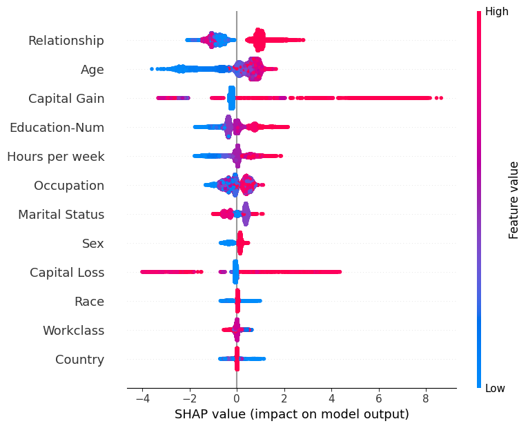

#### **Local waterfall plots**

These explain individual predictions, and hence are essential to build a good intuition for how your model behaves. You can use these to highlight how features like **captial gain** can have different impacts on predictions depending on interactions with other features. Waterfall plots are also great for debugging extreme predictions and are a necessary part of building trust from stakeholders. The downside of these waterfall plots is that they do not scale. You have to stare at an awful lot of these to understand all the key interactions.

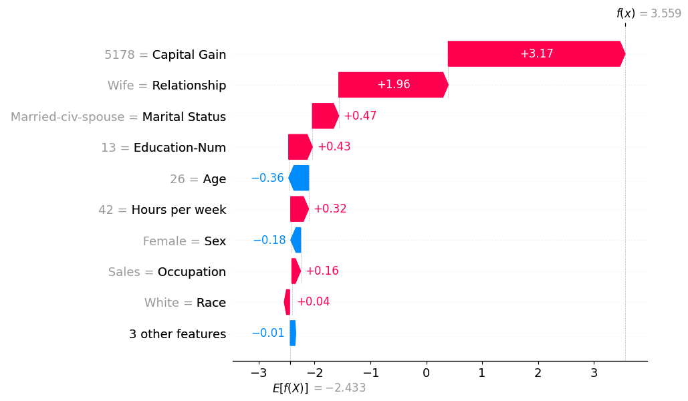

#### **Dependence plots**. 

These are probably underutilised (at least by me). In effect, they zoom in on an individual feature in that summary plot, e.g., the hours per week feature.

 

Looking at this summary plot alone, you might take away: "*More hours = higher prediction, sounds sensible, well done model*". But dependence plots will expand this and plot the relationship between hours and its contribution to the model prediction. This enhanced plot actually tells us the relationship is more interesting and working more than 50 hours a week does not increase the model's prediction further. Colouring these dots by a second feature can also tease out important interaction effects between features. The downside of dependence plots though is needing to do this analysis for every feature (and interaction feature) separately.

## Clustering SHAP values

Maybe this standard SHAP analysis is enough for a Data Scientist building models but there is something missing to help with the  "*Explain to a stakeholder what the model is doing in 5 minutes*" without losing them in a sea of red and blue dots or causing them to take away just one point like "*Relationship is most important*".

***The solution I'm proposing is to create 'model explanation **archetypes**' derived from clustering individual SHAP explanations.***

Clustering is typically applied to raw input features, but from my experience, struggles to find many practical uses in industry. Likely because most business problems can be much better solved with supervised classification and regression models. But maybe we can find a use for clustering here...

Each model prediction produces a vector of SHAP values, representing how each feature contributes additively towards the final log-odds prediction (which is then into a probability). If you look back to the waterfall plot, you can see this vector displayed visually.

As there are 12 features, each prediction lives in a 12-dimensional SHAP space where each dimension is the contribution of that feature to the final prediction. Two people with similar waterfall plots will be close to each other in this SHAP-space. And similarly people with opposite waterfall plots will be far away. This means that for two predictions that have similar probabilities (e.g., 0.5) but for completely different reasons, they will be far apart in SHAP space.

***This SHAP-space will likely have clusters of predictions symbolising people who have very similar prediction explanations. If we were to identify these clusters, this could give us a set of model explanation **archetypes** we can use to help describe how the model makes its decisions.***

Lets firstly see if there is some structure here in SHAP space. TSNE is dimensionality reduction technique that projects high-dimensional data into 2D while preserving neighborhood structure. The results of this are shown below and does indicate there may be some clusters of SHAP-explanations we can identify. 

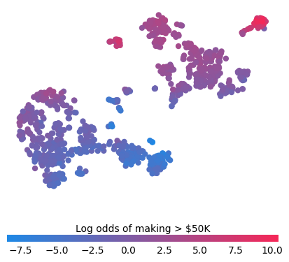

There are a lot of potential decisions at this point: 
- Do we use dimensionality reduction (like TSNE above) before clustering? 
- Which clustering algorithm do we chose? 
- How many clusters?

Maybe there are optimal answers to these questions, or maybe it depends on your SHAP values, or maybe the choices are arbitrary. For now im going to ignore them and just use what I felt was the simplest choices that seemed to work okay:

- I applied **k-means clustering** directly to my 12-dimensional SHAP values to create 8 clusters (8 chosen for convenience)
- Each cluster has a centroid in SHAP-space which I will use as my archetypal explanation for that cluster.

***Each cluster centroid represents a distinct way the model reasons about predicting if someones income is >50k.***

## Our Archetypes

To be concise I'll explore only four of the resulting clusters.

For each Archetype, I created a waterfall plot where the SHAP values correspond to the centroid values. And for each feature value in the waterfall plot, I display the three most common values (and their counts) within that cluster. For example, inside the first cluster (Archetype 1), there were 3402 husbands, and 419 wives.

#### Archetype 1: The Stable Married  
- Early-Middle-aged, steady 40+ hour weeks
- Strong positive model contribution from relationship/marital status.  
- Model consistently leans toward **higher income predictions**.  
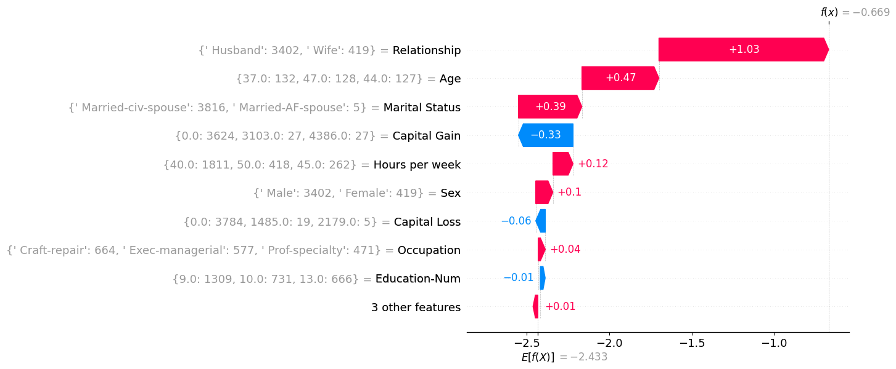

#### Archetype 2: The Struggling Youth  
- Young, single, less working hours, often in service jobs.  
- Model pushes strongly toward **low income predictions**.  
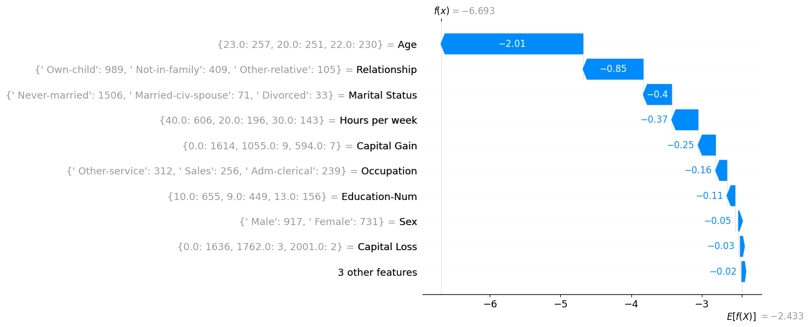

#### Archetype 3: The Young Professional  
- Single, mid-late 20s, educated, office job sometimes working long hours.
- Model typically predict around the **average** for the population.
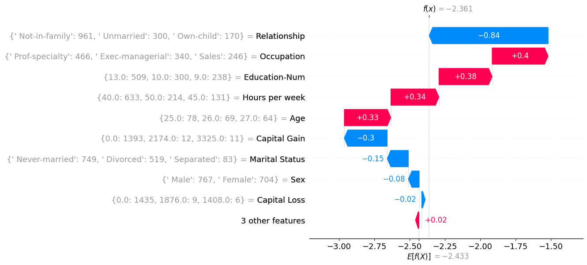

#### Archetype 4: The Elite High Earner  
- Huge capital gains, professional occupations, stable married life.  
- Almost always predicted as **high income**.  
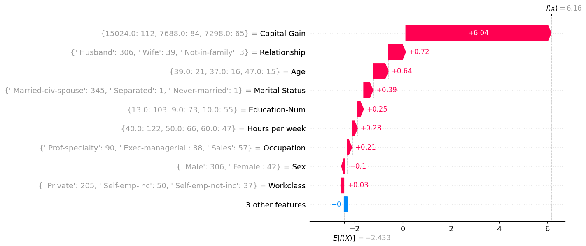

As a sense check I sampled individual people within the **Elite High Earner** cluster and compared them to the cluster centroid to see if this archetype did represent the general cluster population. This seems to be true for this cluster which is a positive, huge capital gains are all the main driver for each of these explanations.

|  |  | |
|------------------------|------------------------|------------------------|
|  | 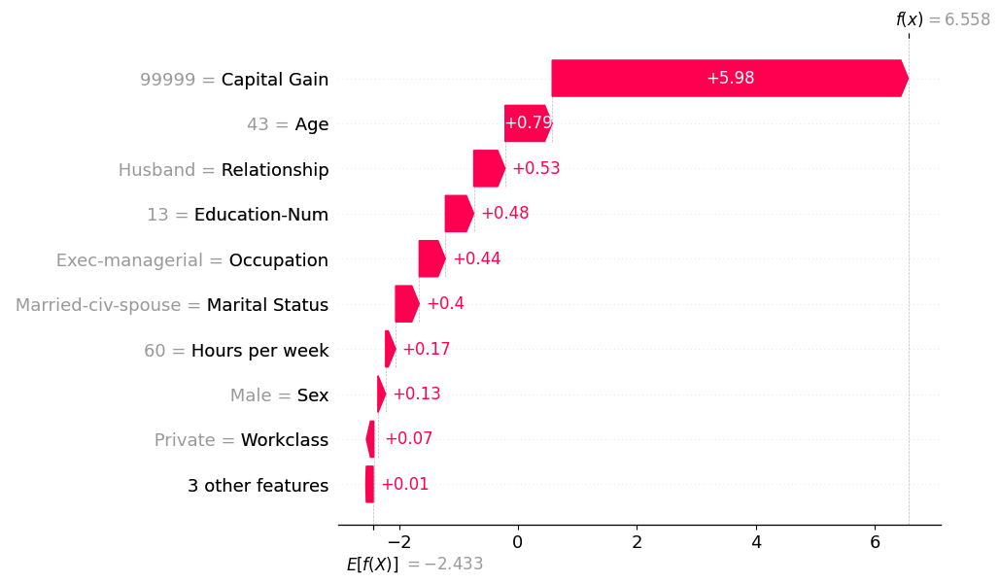 |  |
| 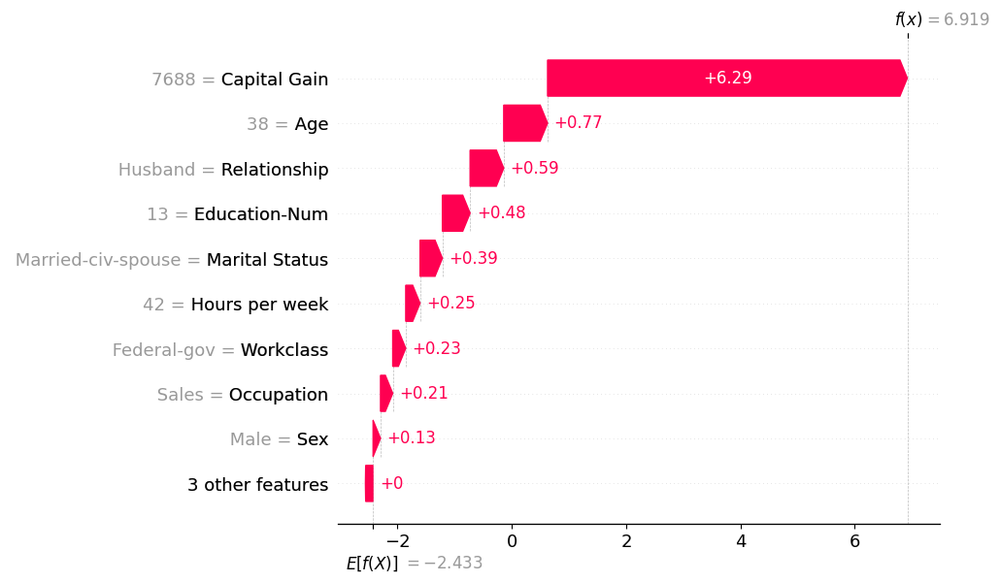 | 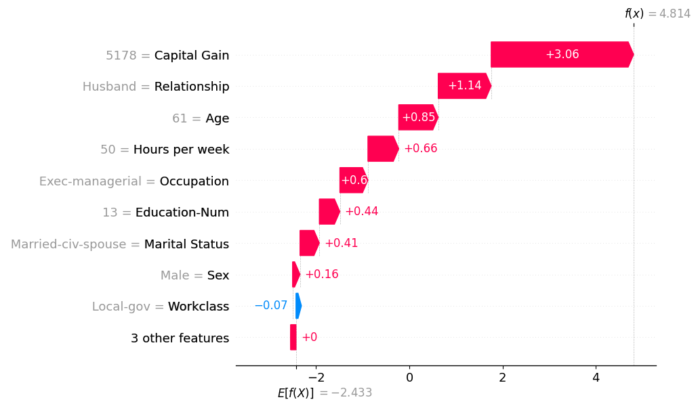 | 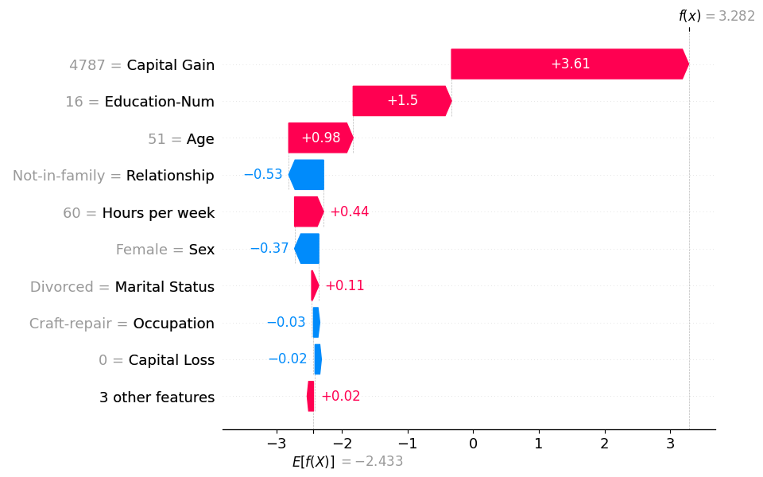 |
| 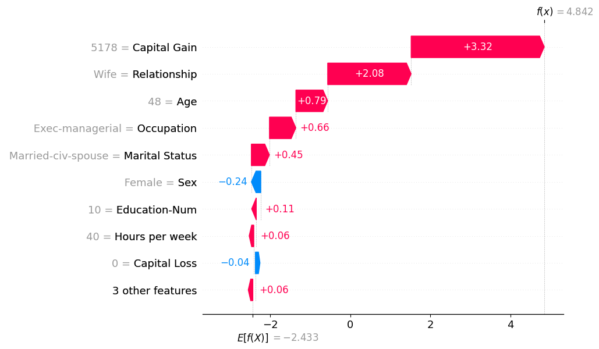 | 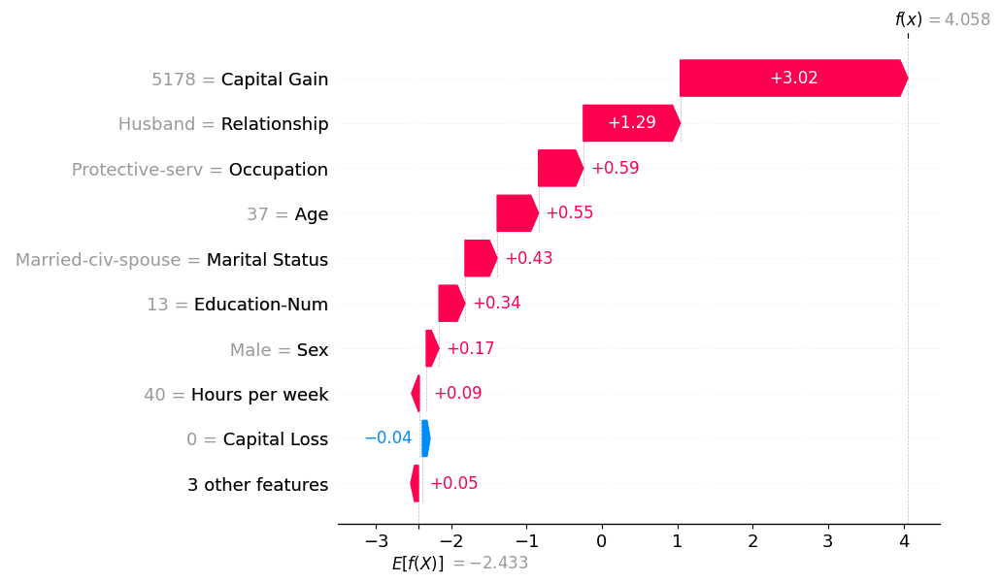 | 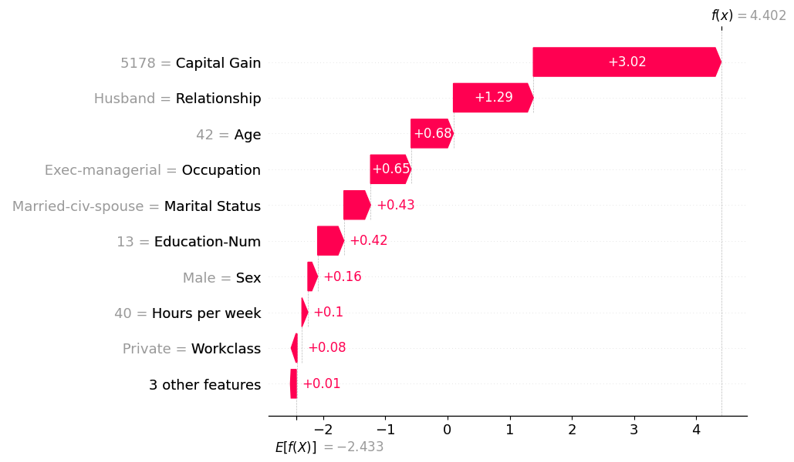 |

---

## What have we learned

These clusters certainly appear to give additional insight on top of the typical SHAP analysis. Instead of having to check every feature combination, it highlights the most common feature interactions inside the model. 

Describing the archetypes also seems like a nice way of communicating what the model has learned to others. Whereas previously you had to say:

> *"The model has learned that features X and Y are important.”*  

we can instead say 

> *"The model has learned to identify these main types of people.”*  

or

> *“The model has eight main ways of reasoning about income.”*  

which definitely feel like they are going to land better and actually improve everyone's understanding of how the model works.

## What next?

There are lots of ways to expand on this idea which I would be really interested to see:

- Spending more time on the clustering methodology. Since you are always clustering in SHAP space, it might be possible to outline an 'ideal' methodology that most people could apply.

- Exploring other datasets to see if the SHAP-clusters look as clear as in the income dataset. For example, will more difficult problems still result in clear SHAP profiles.

- A more simple addition to my analysis is to look at the prediction accuracy of each cluster and identify types of predictions the model struggles with.

## Wrapping up

In this post we have gone beyond standard SHAP analysis to cluster SHAP-values, producing archetypal model explanations. This technique can help summarise how a model reasons about its predictions in a way that is easy to communicate to stakeholders. I hope this technique can be a useful addition to your ML model explainability toolkit. 

## Related Work and code

This work is mostly built from one of the [tutorials](https://shap.readthedocs.io/en/latest/example_notebooks/tabular_examples/tree_based_models/Census%20income%20classification%20with%20LightGBM.html#) within the SHAP docs. Then using Kmeans from [sklearn](https://scikit-learn.org/stable/modules/generated/sklearn.cluster.KMeans.html) to create clusters and centroids. Then only a small bit of code is needed to create the waterfall plots for each cluster centroid (archetype).

Whilst writing this post I found out that there are examples of others clustering SHAP values. The first mention was funnily enough in the original [TreeSHAP paper](https://arxiv.org/abs/1802.03888) from 2019. They used the same dataset and clustered in a different way to produce a stacked force-plot where they ordered the explanations by similarity. It's a small section of the paper but they do try to name this technique **supervised clustering**. 
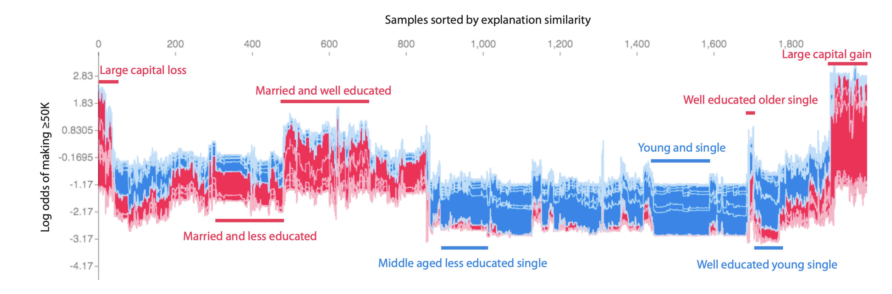

There are also a small number of academic examples of this *supervised clustering* you can find on [google scholar](https://scholar.google.com/scholar?hl=en&as_sdt=0%2C5&q=supervised+clustering+shap&btnG=). If I'm honest though, I don't think *supervised clustering* is really a good name for what is already well described with a name like SHAP-clustering.

